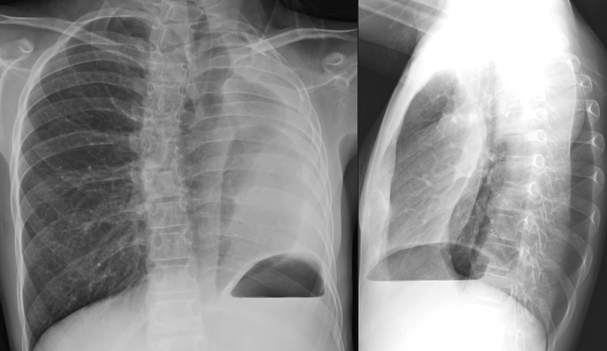
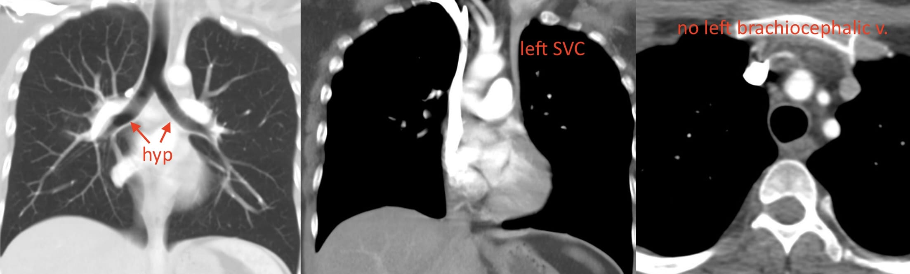
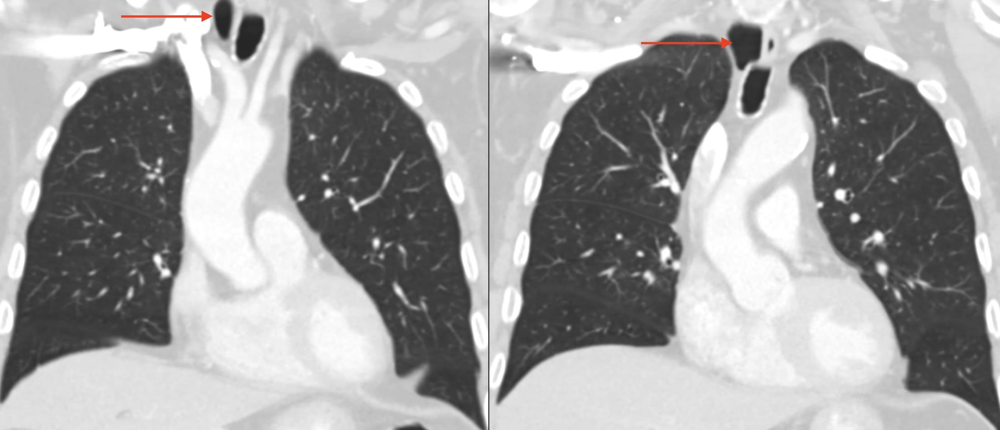

```{r setup, include = FALSE}
options(htmltools.dir.version = FALSE)
library(knitr)
library(metathis)
library(xaringanExtra)
library(showtext)
library(kableExtra)
library(icons)
opts_chunk$set(echo=FALSE)

# set engines
knitr::knit_engines$set("markdown")

xaringanExtra::use_panelset()
# xaringanExtra::use_share_again()
xaringanExtra::use_tile_view()

```

```{r xaringan-themer, include=FALSE, warning=FALSE}
library(xaringanthemer) 
style_mono_light(base_color = "#23395b")
```

```{r meta, echo=FALSE}
meta() %>%
  meta_general(
    description = "A thoracic case conference",
  ) %>% 
  meta_name("github-repo" = "howardm") %>% 
  meta_social(
    title = "Case Conference",
    url = "https://howardm.github.io/CaseConferenceFebruary22nd2022",
    image = "http://chestradiologists.org/twitter-card4.jpg",
    image_alt = "",
    og_type = "website",
    og_author = "Howard Mann",
    twitter_card_type = "summary_large_image",
    twitter_creator = "@howardm19"
  )
```  


class: inverse, center, middle

### Thoracic Case Conference

### *Things that grow up with you*


### .blue[Howard Mann, M.D.]

### Department of Radiology and Imaging Sciences | University of Utah


```{r icon-style}
icon_style(fontawesome("link"), scale = 1, fill = "white")
```
howardmann.us


.big[February 22nd, 2022]


---
class: center, middle

It takes a while for all the conference CT data to download. Wait a minute or two.


<!----------------------------- SLIDE BREAK ----------------------------->

---

layout: true

background-image: url(images/circle-cropped.png)
background-position: 98% 1%
background-size: 4%

---

class: middle

.bigger[Introduction

Every patient in this Case Conference does not have symptoms directly related to the interesting anatomy.]


<!----------------------------- SLIDE BREAK ----------------------------->
---
class: inverse
name: case1

.blue[Case 1]

.panelset[


.panel[.panel-name[Imaging]

<br>

.center[]

.smallest[Case courtesy of Jeff Kanne, M.D.]

] <!--end of panel-->

.panel[.panel-name[Explanation]

Imaging findings are those of an extralobar sequestration:

* a systemic artery from the aorta .red[&xrarr;]
* venous drainage to the hemiazygos vein .blue[&xrarr;]
* a separate pleural envelope .yellow[&xrarr;]

.center[]


] <!--end of panel-->

] <!--end of panelset-->

<!----------------------------- SLIDE BREAK ----------------------------->

---

class: inverse
name: case2

.blue[Case 2]

.panelset[


.panel[.panel-name[Imaging]

<br>

.center[]

] <!--end of panel-->

.panel[.panel-name[Explanation]

.pull-left[

.big[A small, blind-ending *cardiac bronchus*.

Sometimes, a small amount of aerated parenchyma is present -- a mini lobe --like in the adjacent case.]

.center[]

]

.pull-right[

.center[]

]

] <!--end of panel-->

] <!--end of panelset-->


<!----------------------------- SLIDE BREAK ----------------------------->

---

class: inverse
name: case3

.blue[Case 3]

.panelset[


.panel[.panel-name[Imaging I]


.center[]

] <!--end of panel-->

.panel[.panel-name[Imaging II]

<br>

.center[]

] <!--end of panel-->

.panel[.panel-name[Explanation]

.grey[Diagnosis: Mediastinal and intra-pulmonary bronchogenic cysts]

.pull-left[

<br>

.center[]

.smallest[Case courtesy of Travis Henry, M.D.]

]

.pull-right[


The genesis of bronchogenic cysts is from the abnormal or late budding of the embryonic ventral lung bud or the tracheobronchial tree which occurs between the 26th and 40th days of gestation.

This abnormal bud subsequently differentiates into a fluid-filled, blind-ending pouch. The location of a bronchogenic cyst depends on the embryological stage of development at which the anomaly occurs. When the abnormal budding happens during early development, the cyst occupies the tracheobronchial tree. 

Cysts that arise later are more peripheral and may involve the lung parenchyma.


]

] <!--end of panel-->


] <!--end of panelset-->


<!----------------------------- SLIDE BREAK ----------------------------->

---

class: inverse
name: case4

.blue[Case 4]

.panelset[


.panel[.panel-name[Imaging I]


.center[]

] <!--end of panel-->

.panel[.panel-name[Imaging II]

<div style="text-align:center;">
<iframe class="pacsbin"
         id="case4"
         src="https://www.pacsbin.com/c/-ylmpOm7kd?s=6211650ea311df5697970ae9&i=6211650ea311df5697970afa&ww=1665&wc=-490&an=false&header=false&notes=false&overlay=false&scale=0.75" 
         style="width: 500px; height: 500px; border: 0;"></iframe>
</div>

] <!--end of panel-->

.panel[.panel-name[Explanation]

.grey[.big[Diagnosis: A unilobar right lung (sporadic)]]

.smallest[Case courtesy of Jeff Kanne, M.D.]

] <!--end of panel-->

] <!--end of panelset-->


<!----------------------------- SLIDE BREAK ----------------------------->

---

class: inverse
name: case5

.blue[Case 5]

.panelset[


.panel[.panel-name[Imaging I]


.center[]

] <!--end of panel-->

.panel[.panel-name[Imaging II]

<br>

.center[]

] <!--end of panel-->

.panel[.panel-name[Explanation]

Diagnosis: Left lung agenesis with horseshoe right lung: a portion of the lung extends into the left hemithorax.

.center[]

A horseshoe lung is often associated with other findings of the *hypogenetic lung syndrome*.

.smallest[Case courtesy of Jeff Kanne, M.D.]

] <!--end of panel-->

] <!--end of panelset-->


<!----------------------------- SLIDE BREAK ----------------------------->

---

class: inverse
name: case6

.blue[Case 6]

.panelset[


.panel[.panel-name[Imaging]

.pull-left[

Incidental findings in a blunt trauma patient]

.pull-right[

<div style="text-align:center;">
<iframe class="pacsbin"
         id="case6"
         src="https://www.pacsbin.com/c/WkP-eTXQkO?s=62116c5da311df5697970e3b&i=62116c5da311df5697970e72&ww=1500&wc=-500&an=false&header=false&notes=false&overlay=false&scale=1.0" 
         style="width: 500px; height: 500px; border: 0;"></iframe>
</div>
]

] <!--end of panel-->

.panel[.panel-name[Explanation]

.grey[Diagnosis: *wandering pulmonary veins*. The veins connect with one another but drain appropriately into the left atrium.]


.center[]


] <!--end of panel-->


] <!--end of panelset-->


<!----------------------------- SLIDE BREAK ----------------------------->

---

class: inverse
name: case7

.blue[Case 7]

.panelset[


.panel[.panel-name[Imaging I]


.center[]

] <!--end of panel-->

.panel[.panel-name[Imaging II]

<br>

.center[]

] <!--end of panel-->

.panel[.panel-name[Explanation]

.grey[Findings:

* bilateral hyparterial bronchi (bilobed lungs)
* persistent left SVC]

<br>

.center[]


] <!--end of panel-->


] <!--end of panelset-->


<!----------------------------- SLIDE BREAK ----------------------------->

---

class: inverse
name: case8

.blue[Case 8]

.panelset[


.panel[.panel-name[Imaging I]


.center[]

] <!--end of panel-->

.panel[.panel-name[Imaging II]

<br>

.center[]

] <!--end of panel-->

.panel[.panel-name[Explanation]

.grey[Findings: right paratracheal air cysts (tracheal diverticula). These are usually very small, and this is the typical location. Infection of them is extremely uncommon.]

<br>

.center[]


] <!--end of panel-->


] <!--end of panelset-->


<!----------------------------- SLIDE BREAK ----------------------------->

---

class: inverse
name: case9

.blue[Case 9]

.panelset[


.panel[.panel-name[Imaging I]


.center[]

] <!--end of panel-->

.panel[.panel-name[Imaging II]

<div style="text-align:center;">
<iframe class="pacsbin"
         id="case9"
         src="https://www.pacsbin.com/c/Zyt2SQVQJO?s=621175c2a311df56979710f1&i=621175c2a311df5697971124&ww=865&wc=145&an=false&header=false&notes=false&overlay=false&scale=1.0" 
         style="width: 500px; height: 500px; border: 0;"></iframe>
</div>

] <!--end of panel-->

.panel[.panel-name[Explanation]

.grey[Findings:

* left pulmonary artery arising from the right artery -- *pulmonary artery sling*.
* complete tracheal cartilage rings with a narrowed trachea.  
These two findings often occur together.]

.smallest[Case courtesy of Tan Mohammed, M.D.]

.pull-left[

.center[]
]

.pull-right[

.center[]
]

] <!--end of panel-->

] <!--end of panelset-->


<!----------------------------- SLIDE BREAK ----------------------------->

---

class: inverse
name: case10

.blue[Case 10]

.panelset[


.panel[.panel-name[Imaging I]

<br>
.center[]

] <!--end of panel-->

.panel[.panel-name[Imaging II]

.pull-left.w40[Review the lungs and tracheobronchial tree.]

.pull-right.w60[


<div style="text-align:center;">
<iframe class="pacsbin"
         id="case10"
         src="https://www.pacsbin.com/c/-JY9SDNX1u?s=62117cbba311df5697971431&i=62117cbba311df5697971432&ww=640&wc=-44&an=false&header=false&notes=false&overlay=false&scale=0.9" 
         style="width: 500px; height: 500px; border: 0;"></iframe>
</div>
]

] <!--end of panel-->

.panel[.panel-name[Findings]

.pull-left.w20[

<br>

* cardiac dextroversion
* bilateral hyparterial bronchi
* midline liver
* polysplenia]

.pull-right.w80[

<br>
.center[]

.smallest[Case courtesy of Jeff Kanne, M.D.]


]


] <!--end of panel-->


.panel[.panel-name[Explanation]

.pull-left[

.small[Bronchial situs is one aspect of visceroatrial situs, which refers to the position of the cardiac atria, lungs, liver, stomach, and spleen relative to the midline.

*Situs solitus* corresponds to the usual arrangement of these organs, whereas *situs inversus* is the mirror image arrangement, and *situs ambiguus* (or heterotaxy) includes other arrangements that cannot be categorized as either situs solitus or situs inversus. 

Among types of situs ambiguus, right isomerism describes a bilateral right-sidedness and left isomerism describes a bilateral left-sidedness. 

*Right isomerism* is typically associated with right bronchial isomerism, bilateral right morphologic atria, asplenia, midline liver, and variably located stomach. 

*Left isomerism* is usually associated with left bronchial isomerism, bilateral left morphologic atria, polysplenia, midline liver, and variably located stomach. 

However, these features are variably associated, and bronchial situs does not always correlate with atrial and abdominal situs.]


]


.pull-right[

.center[]

.small[The atria maintain their laterality throughout development; hence, they define the cardiac situs. Neither atrial nor tracheobronchial tree morphology is a reliable marker of the position of the ventricles, the cardiac apex, or the great arteries which must be identified and reported separately.]


]

] <!--end of panel-->


] <!--end of panelset-->


<!----------------------------- SLIDE BREAK ----------------------------->

---


class: inverse
name: case11

.blue[Case 11]

.panelset[


.panel[.panel-name[Imaging I]

<br>
.center[]

] <!--end of panel-->

.panel[.panel-name[Imaging II]

.pull-left.w30[Yes, the patient has pulmonary emboli!

Evaluate the tracheobronchial tree and predict what you might see in the upper abdomen.]

.pull-right.w70[


<div style="text-align:center;">
<iframe class="pacsbin"
         id="case11"
         src="https://www.pacsbin.com/c/Zk5q9WHXyd?s=62118d68a311df5697971b19&i=62118d68a311df5697971b6d&ww=763&wc=67&an=false&header=false&notes=false&overlay=false&scale=0.4" 
         style="width: 450px; height: 450px; border: 0;"></iframe>
</div>
]

] <!--end of panel-->

.panel[.panel-name[Explanation]


.pull-left[

.center[]

.center[]

]

.pull-right[


.center[]

.center[Azygos continuation of the IVC may occur.]

]


] <!--end of panel-->

.panel[.panel-name[Review Article]


Here is a nice review article on this topic from which the summary graphic is taken:  

<br>

.content-box-blue[

https://howardm.github.io/CaseConferenceFebruary22nd2022/assets/TracheobronchialSitus.pdf]


] <!--end of panel-->

] <!--end of panelset-->


<!----------------------------- SLIDE BREAK ----------------------------->

---

class: inverse
name: case12

.blue[Case 12]

.panelset[


.panel[.panel-name[Imaging]

Find (mediastinal and lung display settings) three interesting findings in this case -- two are subtle!

<div style="text-align:center;">
<iframe class="pacsbin"
         id="case12"
         src="https://www.pacsbin.com/c/-yWBocRQkd?s=6212828ba311df569797b924&i=6212828ba311df569797b925&ww=607&wc=71&an=false&header=false&notes=false&overlay=false&scale=0.7" 
         style="width: 450px; height: 450px; border: 0;"></iframe>
</div>


] <!--end of panel-->

.panel[.panel-name[Explanation]

Findings: 

* a tracheal bronchus
* a *right top pulmonary vein* (follow it from the right upper lobe to enter the superior left atrium)
* an azygos fissure

.center[]

.smallest[Case courtesy of Travis Henry, M.D.]

] <!--end of panel-->

] <!--end of panelset-->


<!----------------------------- SLIDE BREAK ----------------------------->

---

class: inverse
name: case13

.blue[Case 13]

.panelset[


.panel[.panel-name[Imaging]

.pull-left[An interesting vascular finding...]

.pull-right[

<div style="text-align:center;">
<iframe class="pacsbin"
         id="case13"
         src="https://www.pacsbin.com/c/b1OhGh0mJ_?s=621284e2a311df569797c46d&i=621284e2a311df569797c46e&ww=1123&wc=179&an=false&header=false&notes=false&overlay=false" 
         style="width: 525px; height: 525px; border: 0;"></iframe>
</div>

]

] <!--end of panel-->


.panel[.panel-name[Explanation]

.grey[Finding: a single, common left pulmonary vein that drains into the posterior left atrium in the midline]


.center[]


] <!--end of panel-->


] <!--end of panelset-->


<!----------------------------- SLIDE BREAK ----------------------------->


---

class: inverse
name: case14

.blue[Case 14]

.panelset[


.panel[.panel-name[Imaging]

.pull-left[Evaluate vessels and airways.]

.pull-right[


<div style="text-align:center;">
<iframe class="pacsbin"
         id="case14"
         src="https://www.pacsbin.com/c/b1ehURAQkd?s=6212882ca311df569797ca36&i=6212882ca311df569797ca5e&ww=807&wc=169&an=false&header=false&notes=false&overlay=false" 
         style="width: 500px; height: 500px; border: 0;"></iframe>
</div>


]

] <!--end of panel-->

.panel[.panel-name[Explanation]

.pull-left[

.grey[Findings:

* bi-lobed lungs
* drainage of a right pulmonary vein into the supra-hepatic IVC (scimitar sign)

Although a systemic artery supplying the right lung is not present, this has the other features of the *hypogenetic lung syndrome*]]

.pull-right[

.center[]]

] <!--end of panel-->


] <!--end of panelset-->


<!----------------------------- SLIDE BREAK ----------------------------->

---

class: inverse
name: case15

.blue[Case 15]

.panelset[


.panel[.panel-name[Imaging I]


.center[]

] <!--end of panel-->

.panel[.panel-name[Imaging II]

.pull-left[Don't be distracted by the lung disease!]

.pull-right[

<div style="text-align:center;">
<iframe class="pacsbin"
         id="case15"
         src="https://www.pacsbin.com/c/Zkn_aykNJd?s=62128ab2a311df569797cd04&i=62128ab2a311df569797cd05&ww=1322&wc=256&an=false&header=false&notes=false&overlay=false" 
         style="width: 500px; height: 500px; border: 0;"></iframe>
</div>

]

] <!--end of panel-->

.panel[.panel-name[Explanation]

.grey[Diagnosis: Another case of *wandering pulmonary veins*]

.center[]

] <!--end of panel-->


] <!--end of panelset-->


<!----------------------------- SLIDE BREAK ----------------------------->
---


class: center, middle

.big[A Conference Summary and Rule:

<br>

.content-box-blue[Vascular and airway anomalies very often occur together -- Kanne's Rule]

<br>

Look for them!]


<!----------------------------- SLIDE BREAK ----------------------------->


```{css echo=FALSE}
.highlight-last-item > ul > li, 
.highlight-last-item > ol > li {
  opacity: 0.2;
}
.highlight-last-item > ul > li:last-of-type,
.highlight-last-item > ol > li:last-of-type {
  opacity: 1;
}
```
